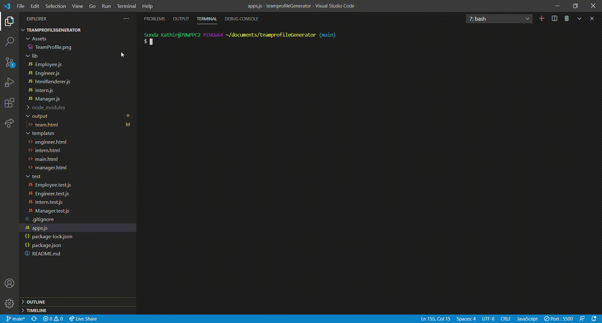

# teamprofileGenerator
It is a command-line-input application run in Node that requests information from the user about members of a team and generates an HTML file displaying that information.

Upon launching the app, the user is asked to describe the first member of their team. The user enters the team member's name, selects that member's role from a list (options include "Engineer," "Intern," and "Manager), enters the member's ID (any string), enters the member's email address, and then must enter another piece of information that will differ depending on what role was selected. If "Engineer" was selected, the app asks the user for the team member's GitHub username; if "Intern" was selected, the member's school is requested; and if "Manager" was chosen, the user is prompted for the team member's phone number.
this is illlustrated as shown below

# screen shot 

# Technology used 
This is created using Object-Oriented Programming concepts. The app is run using Node.js, and uses the "Inquirer" and "FS" node modules. Files for different objects are also stored in separate .js files and passed among one another using module.exports and require.
